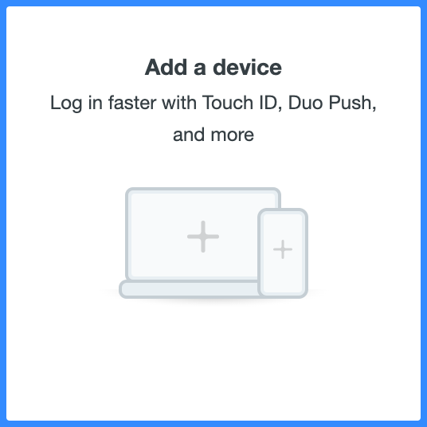
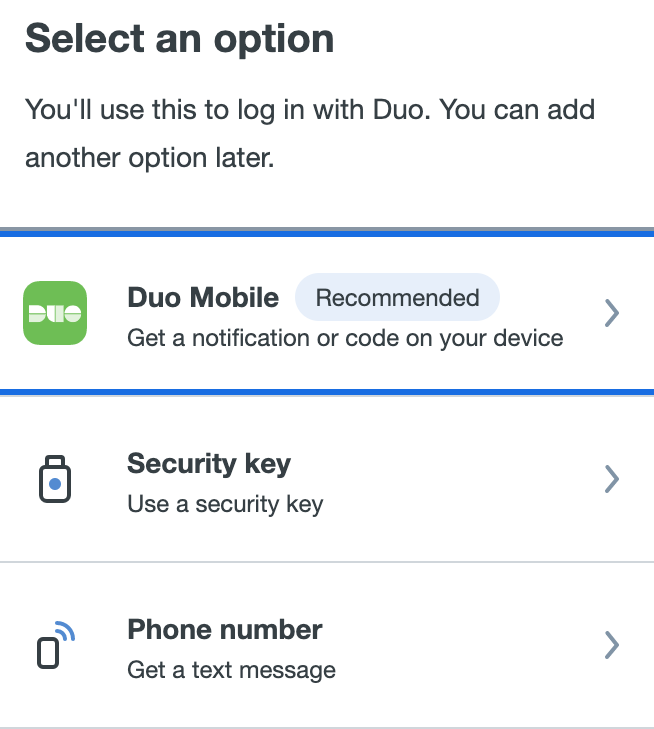
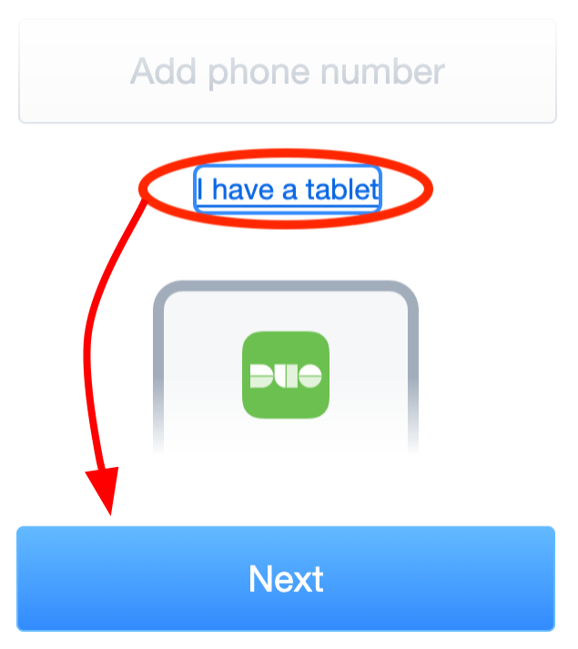
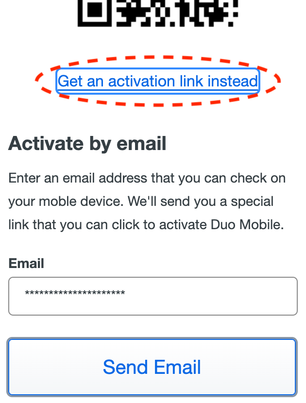
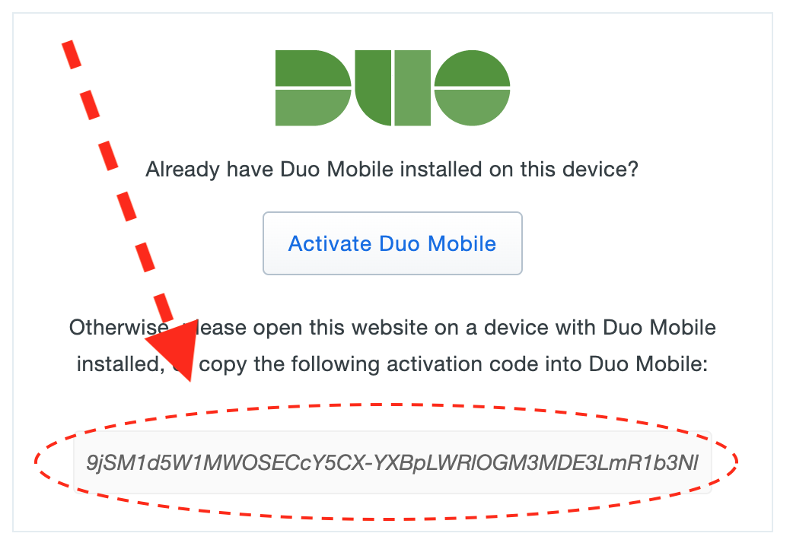
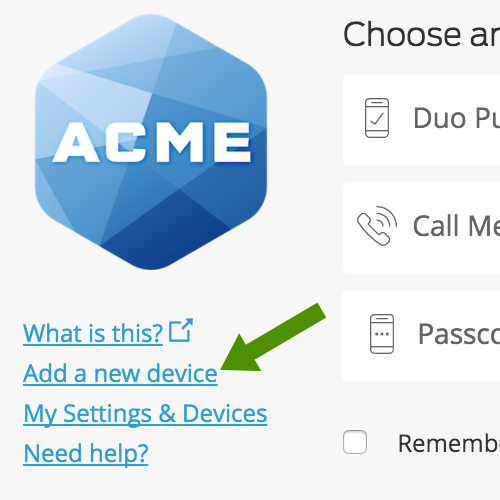
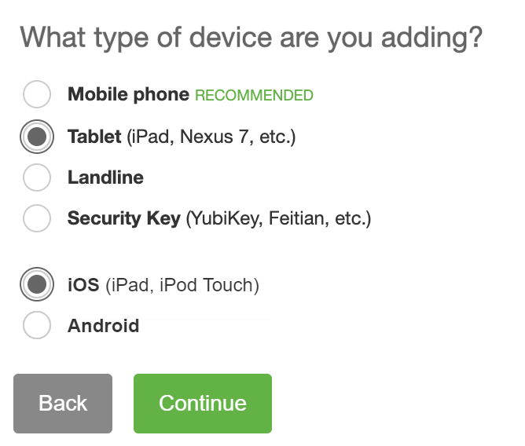
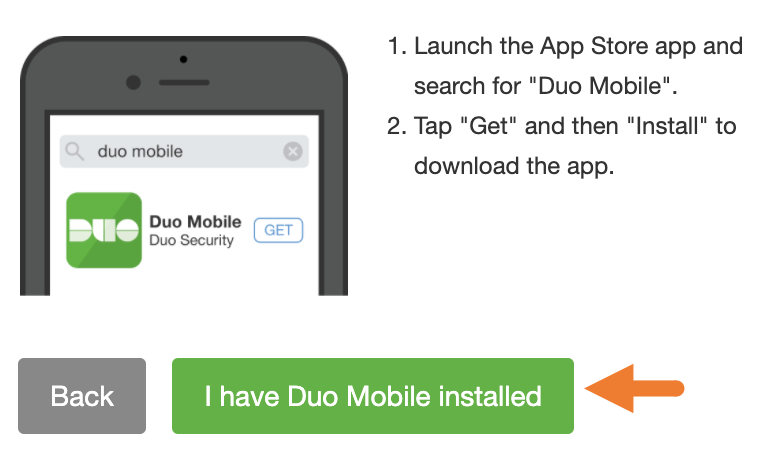
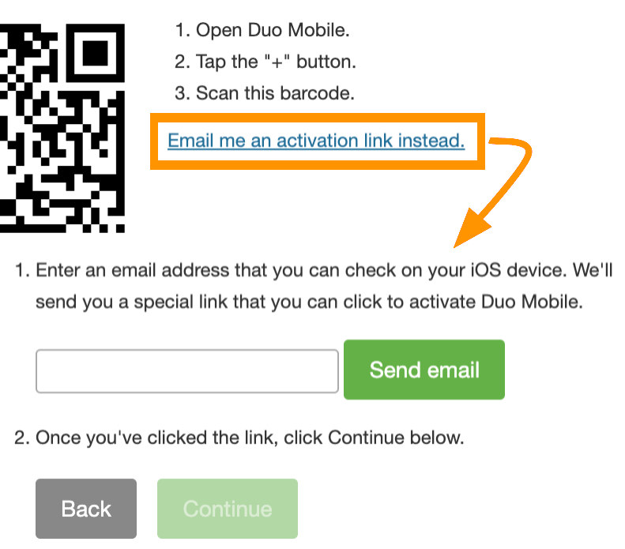

# Setup Tutorial
Welcome to Duochrome! Let's make it one of your Duo devices.

Before you begin, navigate to your organization's Duo Mobile devices page. You can usually google the name of your organization followed by "duo mobile" to find the link.

> **Note:** Your organization's Duo Mobile devices page either uses the new Universal Prompt, or the dated Traditional Prompt. You can toggle between them with these buttons:
> 
> 

Quick links:
* [Universal Instructions](#universal-instructions)
* [Traditional Instructions](#traditional-instructions)

# Universal Instructions
#### 1. Add a new device

Once you navigate to your organization's Duo Mobile device manager website, click the Add a new Device button.

#### 2. Click Duo Mobile

Duochrome is treated like the app, so click the Duo Mobile app option. You don't need to download it.

#### 3. Click I have a tablet, then Next

You don't need to enter your phone number, it doesn't affect the setup. Click the I have a tablet button instead. If you include your phone number, it'll simply associate the number with the device and have no impact on functionality.

#### 4. Scan the QR Code
A QR code will be generated. Open Duochrome on the same page as the QR code and it should handle the rest. If you don't see a QR code, or it's failing to scan it, go to Step 6.

#### 5. Email code to yourself

If the QR code didn't work, click Get an activation link instead and get your inbox ready to receive the code. Duo will email you the activation code. Once you receive it, click the link included in the email. Make sure you open this link on your computer and not your phone to prevent the Duo Mobile app from auto-opening it.

#### 6. Activate

After opening the link, you'll see a box in the center of the page containing the text-based version of the activation code. Copy and paste the activation code into the box in Duochrome on Step 6, then click activate.

# Traditional Instructions
#### 1. Add a new device

Once you navigate to your organization's Duo Mobile device manager website, click the Add a new Device** button.

#### 2. Click Tablet, then iOS

Duochrome works like the phone app (without the phone), so click the tablet option, then iOS.

#### 3. Click I have Duo Mobile installed.

Lie lol

#### 4. Scan the QR Code
A QR code will be generated. Open Duochrome on the same page as the QR code and it should handle the rest. If you don't see a QR code, or it's failing to scan it, go to Step 6.

#### 5. Email code to yourself

If the QR code didn't work, click Email me an activation link instead and get your inbox ready to receive the code. Duo will email you the activation code. Once you receive it, click the link included in the email. Make sure you open this link on your computer and not your phone to prevent the Duo Mobile app from auto-opening it.

#### 6. Activate

After opening the link, you'll see a box in the center of the page containing the text-based version of the activation code. Copy and paste the activation code into the box in Duochrome on Step 6, then click activate. Then you can click the continue button back on the website.
