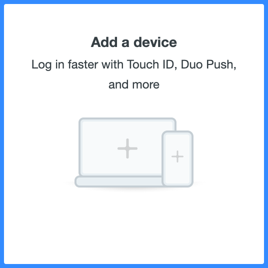
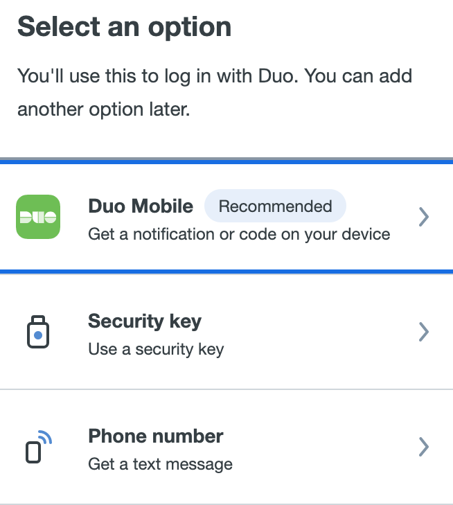
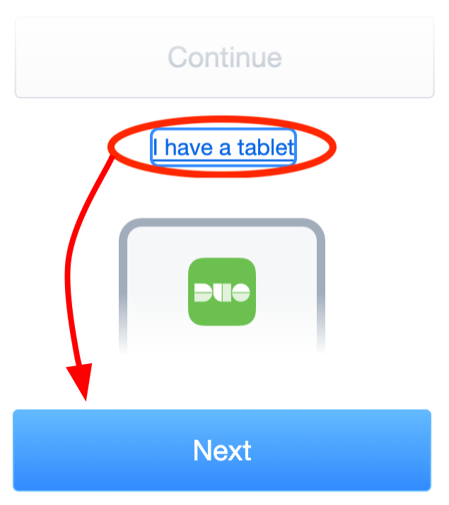
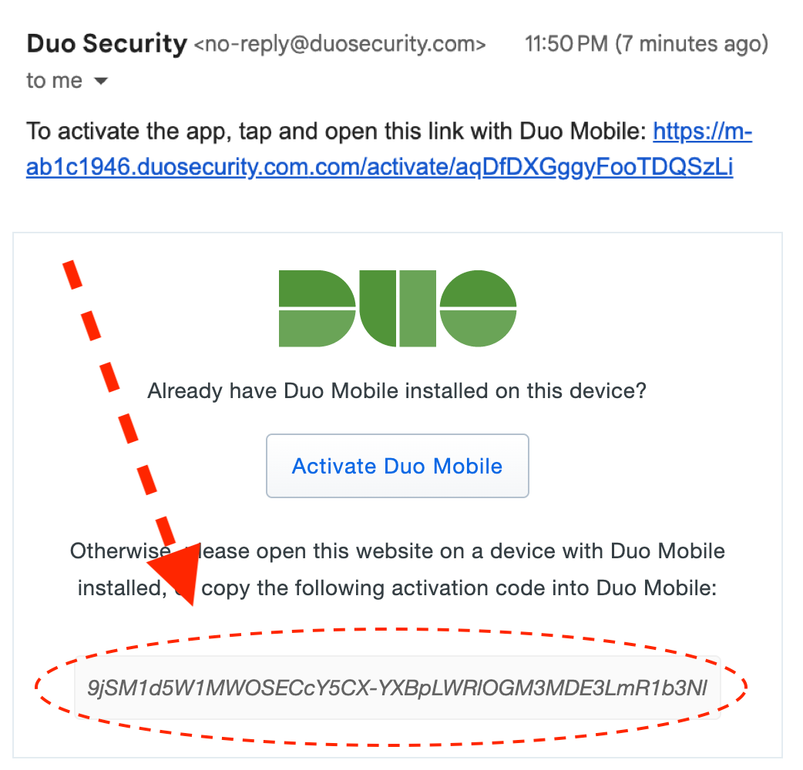
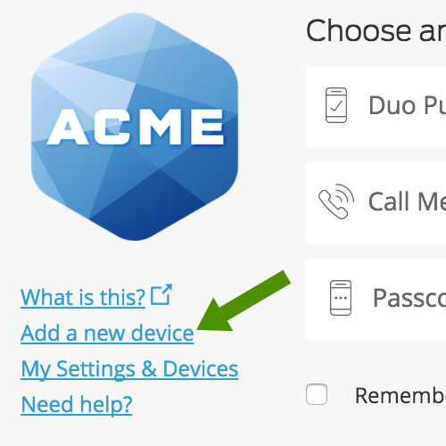
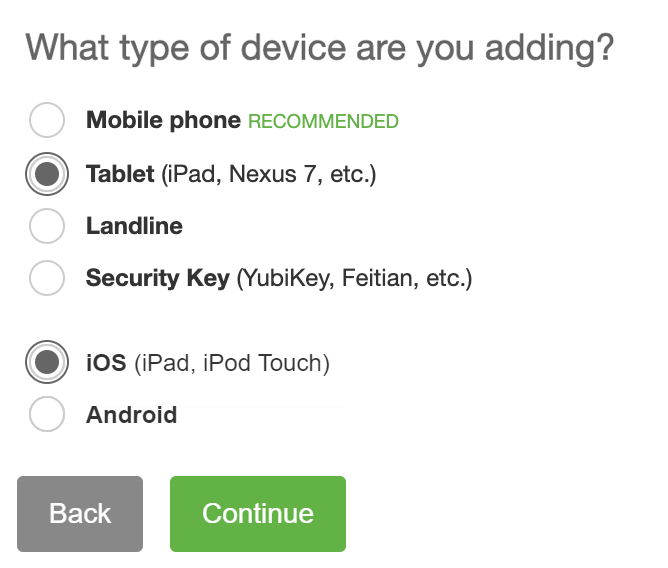
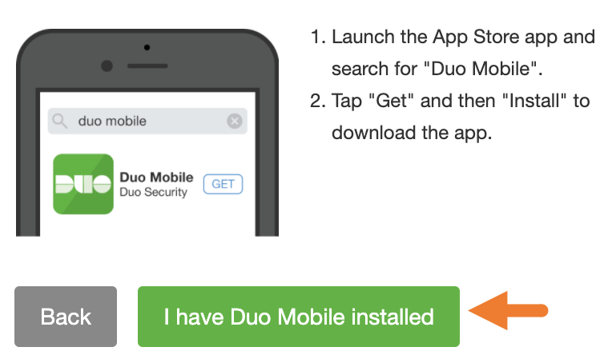
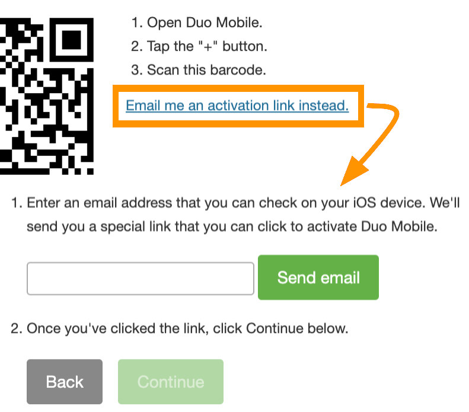

# Tutorial
Welcome to Auto 2FA!

Normally, you'd enter your username / password, then a Duo screen pops up, and finally your phone gets a notification that someone is trying to login that you then approve. But Auto 2FA acts as the phone for you. Setting up Auto 2FA creates a "virtual device," then when you try to login, you'll tell Duo Mobile to send the login attempt to that virtual device. By the end of setup, you'll be able to login with your original device *and* Auto 2FA's virtual device.

> [!IMPORTANT]
> Your Duo account can have multiple devices, and you can pick the one you want to login with. You *have* to pick the device Auto 2FA created by clicking **Other options** and selecting Auto 2FA's virtual device.

- [Setup](#setup)
- [Usage](#usage)

## Setup
Before you begin, navigate to your organization's Duo Mobile devices page. If you don't know where the link is, you can usually google the name of your organization followed by "duo mobile".

> [!NOTE]
> Your organization's Duo Mobile devices page either uses the new Universal Prompt, or the dated Traditional Prompt. You can toggle between them with these buttons:
> 
> 

Quick links:
- [Universal Instructions](#universal-instructions)
- [Traditional Instructions](#traditional-instructions)

### Universal Instructions
#### 1. Add a new device
</img>

Once you navigate to your organization's Duo Mobile device manager website, click the *Add a new Device* button.

#### 2. Click Duo Mobile
</img>

Auto 2FA is treated like the app, so click the Duo Mobile app option.

#### 3. Click I have a tablet, then Next
</img>

You don't need to enter a phone number. Click the *I have a tablet* button instead. If you include your phone number, it'll simply associate the number with the device and have no impact on functionality.

#### 4. Scan the QR Code
A QR code will be generated. Open Auto 2FA on the same page as the QR code and it should handle the rest. If you don't see a QR code (or it's failing to scan it) keep reading.

> [!WARNING]
> If the QR code didn't work, keep reading. Otherwise you are good to go!

#### 5. Email code to yourself
</img>

If the QR code didn't work, click *Get an activation link* and get your inbox ready to receive the code. Duo will email you the activation code. Once you receive it, click the link provided in the email. Make sure you open this link on your computer and not your phone to prevent the Duo Mobile app from auto-opening it.

#### 6. Activate
</img>

After opening the link, you'll see a box in the center of the page containing the activation code. Copy and paste it into the box in Auto 2FA on Step 6, then click activate.

### Traditional Instructions
#### 1. Add a new device
</img>

Once you navigate to your organization's Duo Mobile device manager website, click the *Add a new Device* button.

#### 2. Click Tablet, then iOS
</img>

Auto 2FA works like the phone app, so click the tablet option, then iOS.

#### 3. Click I have Duo Mobile installed.
</img>

#### 4. Scan the QR Code
A QR code will be generated. Open Auto 2FA on the same page as the QR code and it should handle the rest. If you don't see a QR code (or it's failing to scan it) keep reading.

> [!WARNING]
> If the QR code didn't work, keep reading. Otherwise you are good to go!

#### 5. Email code to yourself
</img>

If the QR code didn't work, click *Get an activation link* and get your inbox ready to receive the code. Duo will email you the activation code. Once you receive it, click the link provided in the email. Make sure you open this link on your computer and not your phone to prevent the Duo Mobile app from auto-opening it.

#### 6. Activate
</img>

After opening the link, you'll see a box in the center of the page containing the activation code. Copy and paste it into the box in Auto 2FA on Step 6, then click activate. Then you can click the continue button back on the website.

## Usage
Now that Auto 2FA is setup, you're ready to start logging in with it. Whenever you try to login to your Duo-protected service, a login attempt is sent to *just one* of your devices (typically it would be your phone). Instead of approving it with your phone, you can click *Other options* to choose another device, and clicking on the device Auto 2FA created for you. Then click on Auto 2FA to approve the login.

> [!TIP]
> If Duo is always sending that first request to your phone, you may be able to configure a "default device" in your organization's device control panel. For me, that unfortunately meant deleting my phone and adding it again to append it behind Auto 2FA in the device list.

### No Logins Found
If you keep seeing **No logins found!**, it means no login attempts were sent to Auto 2FA. You probably sent the login attempt to another device (like your phone). Auto 2FA can't approve a request sent to a device it didn't create. You need to select **Other options**, and choose the device created by Auto 2FA. It's only then that you can click Auto 2FA and log in.

### Login Clicks
You can set the amount of clicks required to log you in with the slider in settings. If there are multiple active login attempts, Auto 2FA will always require you to review and select the correct one regardless of this setting.

#### Zero-clicks
Least safe, most convenient. When you browse to a Duo login page (pages that match *https://\*.duosecurity.com/frame/\*/auth/prompt\** or *https://\*.duosecurity.com/frame/prompt\**), Auto 2FA will start trying to approve a single login the moment it finds one. No click required. This is unsafe as it will start checking for login attempts before yours fully loads. I'm considering requiring at least the IP addresses of the client and the transaction to match in order to approve this type of login.

#### One-click
The default behavior. Clicking on the extension will approve a single login.

#### Two-clicks
Most safe, least convenient. This is the Duo Mobile app behavior. Every login attempt will require you to review it before it's approved.
